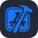

  

<h1 align="center">しおり🔖</h1>

  

---

## Tech Stack

**Languages**

  

**Tools**

  
  
  
  
  
  
  
  
  
  
  

**Services**

  
  
  
  
  
  
  

---

## GitHub Activity

  

 

  
  

---

  <i>step by step</i>

